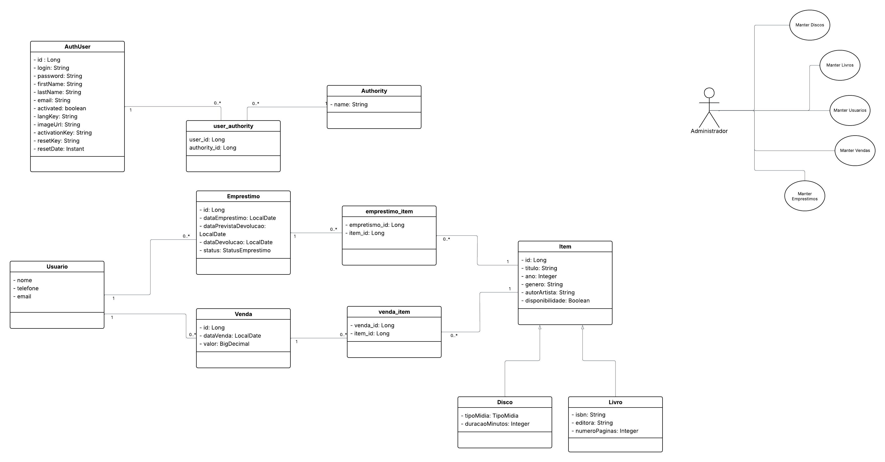

Sistema de Sebo — Trabalho Acadêmico

Este projeto é um Sistema de Sebo (compra, venda e gerenciamento de livros usados) desenvolvido como parte do trabalho da disciplina Desenvolvimento Web / Engenharia de Software.

A aplicação foi gerada com JHipster 8.11.0, integrando um ecossistema moderno de desenvolvimento web full-stack.
🛠️ Tecnologias Utilizadas
Backend

Java 21 (OpenJDK 21)

Spring Boot

Spring Data JPA / Hibernate

Maven

Frontend

Angular

Webpack (via JHipster)

Banco de Dados

PostgreSQL

Ferramentas e Suporte

OpenAPI / Swagger

Jest (testes frontend)

Docker e Docker Compose (opcional)

JHipster Dev Tools

Requisitos para Rodar o Projeto

Antes de iniciar a aplicação, verifique se possui instalado:

Node.js ≥ 22.15.0

Java OpenJDK 21

PostgreSQL (versão recomendada: 14+)

Maven Wrapper (já incluso no projeto)

Configuração do Banco de Dados

Crie um banco PostgreSQL local:

CREATE DATABASE sebo;

Edite o arquivo de configuração de desenvolvimento:

src/main/resources/config/application-dev.yml

Exemplo de configuração:

spring:
datasource:
url: jdbc:postgresql://localhost:5432/sebo
username: postgres
password: 12345678

Ajuste usuário/senha conforme seu ambiente.

Para roda a aplicação:

./mvnw

A aplicação iniciará em:

http://localhost:8080

